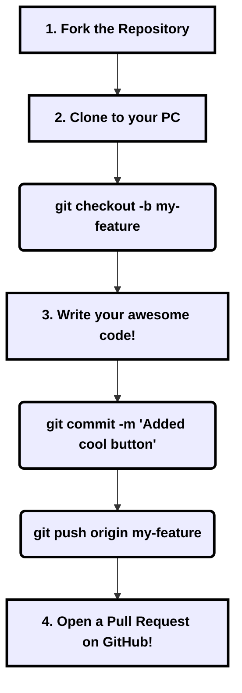

# 🤝 Contributing to StadiumFlow AI

First off, thank you for considering contributing! Whether you are an absolute beginner writing your first line of code, or a seasoned pro, **you are welcome here.**

We want to make contributing as fun, colorful, and easy to understand as possible. Follow this guide, and you'll have your first feature live in no time! 🚀

---

## 🎨 The "Neo-Brutalist" Mindset

StadiumFlow AI has a very specific, bold design language called **Neo-Brutalism**. When you add new buttons, cards, or text, try to use these Tailwind CSS classes:

| Element | Tailwind Classes to Use | Visual Effect |
| :--- | :--- | :--- |
| **Containers** | `rounded-2xl border-4 border-black bg-white` | Thick black outline! |
| **Shadows** | `shadow-[4px_4px_0_#000]` | Hard, flat comic-book shadow. |
| **Fonts** | `font-black uppercase tracking-widest` | Very loud, bold text! |

> [!TIP]
> If you aren't sure how to style something, just copy the classes from an existing button! Check out `components/score-ticker.tsx` for a great example.

---

## 🗺️ The Developer Workflow (Step-by-Step)

Here is exactly how you add a feature, from start to finish. Don't let Git scare you, it's just like saving versions of a document!



### Detailed Steps for Beginners:

#### 1. Fork & Clone
Click the **"Fork"** button at the top right of the GitHub page. This creates a copy of StadiumFlow AI on your own account. Then, clone it to your computer:
```bash
git clone https://github.com/YOUR-USERNAME/StadiumFlow-AI.git
cd StadiumFlow-AI
npm install
```

#### 2. Create a Branch
Never write code on the `main` branch! Create a safe space for your new feature:
```bash
git checkout -b add-new-trivia-questions
```

#### 3. Make Your Changes
Open the code in your favorite editor (like VS Code). Add your features! Run `npm run dev` to see your changes live in the browser at `http://localhost:3000`.

#### 4. Commit and Push
Save your work to your "Git" history, and push it up to your GitHub account:
```bash
git add .
git commit -m "Added 5 new FIFA trivia questions"
git push origin add-new-trivia-questions
```

#### 5. Open a Pull Request (PR)
Go back to the original StadiumFlow AI GitHub page. You will see a big green button that says **"Compare & pull request"**. Click it! Describe what you changed, and our team will review it and merge it into the main project. 🎉

---

## 🐛 Found a Bug?

You don't even have to write code to contribute! If you find a bug:
1. Go to the **Issues** tab on GitHub.
2. Click **New Issue**.
3. Give us a clear title (e.g., *"SOS Button doesn't flash red on Safari"*).
4. Tell us how to recreate the bug so we can fix it!

> [!IMPORTANT]  
> If the bug is related to **Security** (like bypassing admin permissions), please do **NOT** open a public issue. Read our [SECURITY.md](SECURITY.md) file instead!

---

<div align="center">
  <h3>Let's build the ultimate stadium experience together! 🏟️⚡</h3>
</div>
