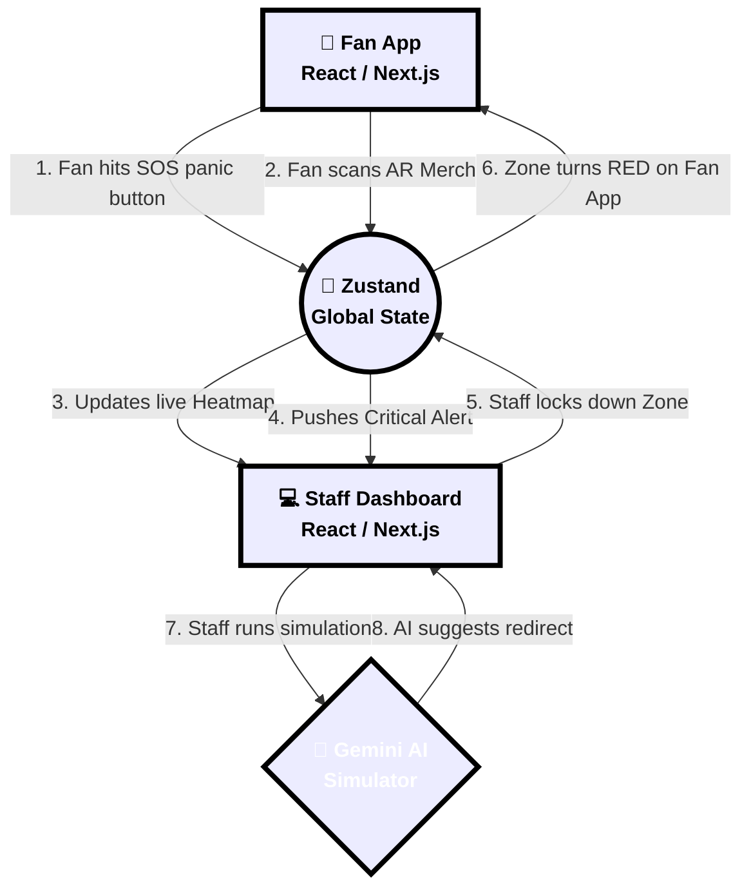
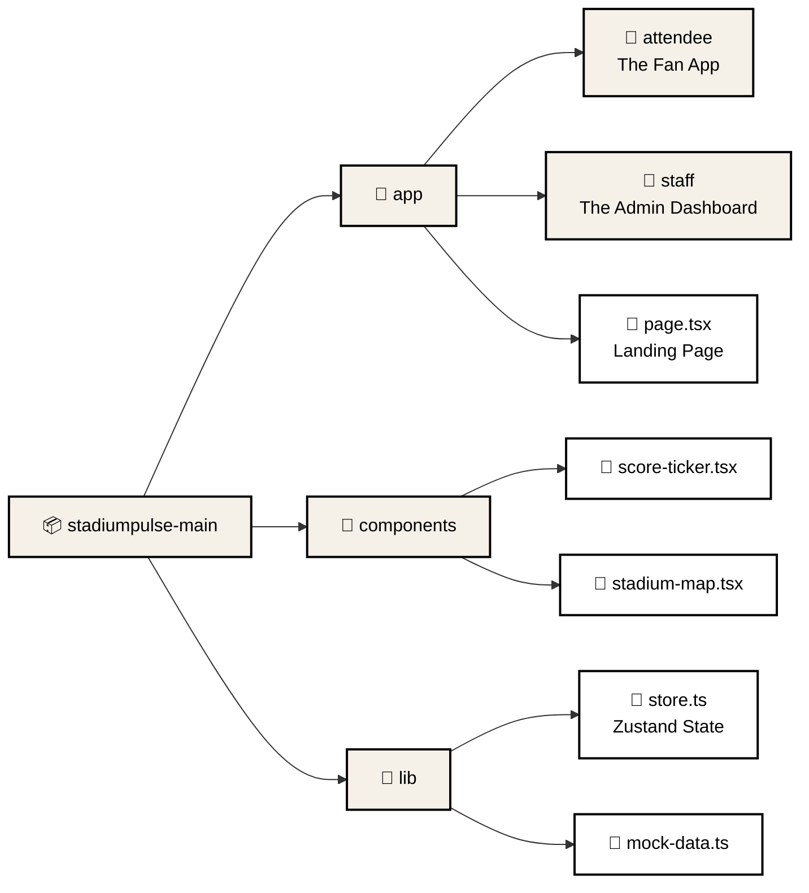

<div align="center">
  
  
  
  
  
  <br/>
  
  
</div>

<br />

<div align="center">
  <h1 align="center">⚡ StadiumFlow AI ⚡</h1>
  <p align="center">
    <strong>The Ultimate AI-Powered Smart Stadium Operations Center for the FIFA World Cup 2026</strong>
  </p>
  <p align="center">
    A stunning <em>Neo-Brutalist</em> web application designed to manage 132,000+ fans in real-time, built for absolute beginners and pros alike!
  </p>
</div>

<br />

---

## 🌟 What is StadiumFlow AI?

Imagine you are managing the biggest stadium in the world. How do you keep 132,000 screaming fans safe, fed, and entertained? **StadiumFlow AI** is the answer! 

It is a dual-dashboard web application:
1. **Fan Dashboard (Attendee PWA):** A vibrant, gamified mobile experience.
2. **Staff Dashboard (Secure Admin):** A highly advanced command center.

This project uses an eye-catching **Neo-Brutalist & Comic Book design style** (think thick black borders, bright neon colors, drop shadows, and big bold text).

---

## 🧠 System Architecture (How it works)

Here is a simple flow chart showing how the Fan App and the Staff Dashboard talk to each other in real-time.



> [!NOTE]  
> **What is Zustand?** Think of Zustand as a giant digital whiteboard. When a fan writes "Help!" on the whiteboard, the staff immediately sees it on their screen without having to refresh the page!

---

## 🔥 Awesome Features Breakdown

<details>
<summary><strong>👇 Click to reveal: 👤 For the Fans (The Gamified Experience)</strong></summary>
<br/>

| Feature | Description | Why it's cool! |
| :--- | :--- | :--- |
| **⚡ Live Hype Meter** | Tracks the stadium's "decibel" level in real-time. | Keeps the energy high! |
| **📸 Jumbotron Fan Cam** | Connects to webcam for vibe checks. | Uses real browser media devices! |
| **🛍️ AR Scavenger Hunt** | Augmented-reality camera scanner. | Gamifies waiting in long lines. |
| **🧠 FIFA Trivia 1954** | Flashcards with historic World Cup facts. | Educational and fun! |
| **🚨 90-Second SOS** | A giant panic button to dispatch staff. | Real-time safety feature. |

</details>

<details>
<summary><strong>👇 Click to reveal: 🛡️ For the Staff (The Command Center)</strong></summary>
<br/>

| Feature | Description | Why it's cool! |
| :--- | :--- | :--- |
| **🗺️ Live Heatmap** | Visual SVG map showing real-time occupancy. | Color-coded status (Green, Yellow, Red). |
| **🤖 Crisis Simulator** | Simulate disasters (e.g., "Heavy Rain"). | AI predicts crowd flow. |
| **🔒 "God Mode"** | Massive red button to lock down zones. | Instantly pushes flashing alerts. |
| **📊 Live Metrics** | Real-time AI Performance tracking. | Beautiful animated progress bars. |

</details>

---

## 🛠️ Tech Stack Explained (For Beginners)

If you are new to web development, don't worry! Here is exactly what we used and why:

* **[Next.js (App Router)](https://nextjs.org/)**: The core framework. It handles our routing (moving between pages like `/fan` and `/dashboard`).
* **[React](https://react.dev/)**: The UI library. We use React "Hooks" like `useState` (to remember things, like if a modal is open) and `useEffect` (to do things when the page loads, like start a webcam).
* **[Tailwind CSS](https://tailwindcss.com/)**: How we style everything! Instead of writing separate CSS files, we use classes like `bg-[#FF3333]` (red background) and `rounded-2xl` (rounded corners).
* **[Zustand](https://github.com/pmndrs/zustand)**: Our global brain. 
* **[Lucide React](https://lucide.dev/)**: Our beautiful, crisp SVG icons.

---

## 🚀 Getting Started (Step-by-Step for Beginners)

Ready to run this on your own computer? Just follow these steps!

> [!IMPORTANT]
> You must have **Node.js** installed on your computer first. [Download it here](https://nodejs.org/) if you don't have it!

### 1️⃣ Clone the Repository
Download the code to your computer. Open your terminal (Command Prompt or Mac Terminal) and run:
```bash
git clone https://github.com/YOUR-USERNAME/StadiumFlow-AI.git
cd StadiumFlow-AI
```

### 2️⃣ Install Dependencies
We need to download all the open-source libraries that make the app work. Type:
```bash
npm install
```
*(Grab a coffee ☕, this takes about 30 seconds!)*

### 3️⃣ Run the Development Server
Time to turn on the engine! Type:
```bash
npm run dev
```

### 4️⃣ Open the App!
Open your favorite web browser and go to:
👉 **[http://localhost:3000](http://localhost:3000)**

---

## 📁 Folder Structure Explained

Here is a map of the project so you don't get lost:



*   **`/app/(attendee)`**: Contains all the screens the everyday Fan sees.
*   **`/app/(staff)`**: Contains the highly secure dashboard for Staff.
*   **`/components`**: Reusable lego blocks! We build a `TriviaCard` once here, and use it anywhere.
*   **`/lib/store.ts`**: The central nervous system. This file holds the `useStaffStore` which manages lockdowns and alerts.

---

## 🎨 Design Guide: How to write "Neo-Brutalist" Code

If you want to contribute, try to match our design style! It's easy, just follow these Tailwind rules:

1.  **Thick Borders:** Always use `border-2 border-black` or `border-4 border-black`.
2.  **Hard Drop Shadows:** Instead of soft blurry shadows, we use hard ones: `shadow-[4px_4px_0_#000]`.
3.  **Neon Colors:** Use our specific hex codes:
    *   🔴 Red: `#FF3333`
    *   🟡 Yellow: `#FFE600`
    *   🟢 Green: `#00FF87`
    *   🔵 Blue: `#00C6FF`

---

## 🤝 Contributing (Join the Team!)

We love beginners! Found a typo? Want to add a new Trivia question?
1. **Fork** the repository (Click "Fork" at the top right).
2. Create a branch: `git checkout -b my-new-feature`
3. Commit changes: `git commit -m 'Added cool feature'`
4. Push to GitHub: `git push origin my-new-feature`
5. Open a **Pull Request**!

---

<div align="center">
  <p>Built with ❤️ and ⚡ for the future of sports entertainment.</p>
</div>
