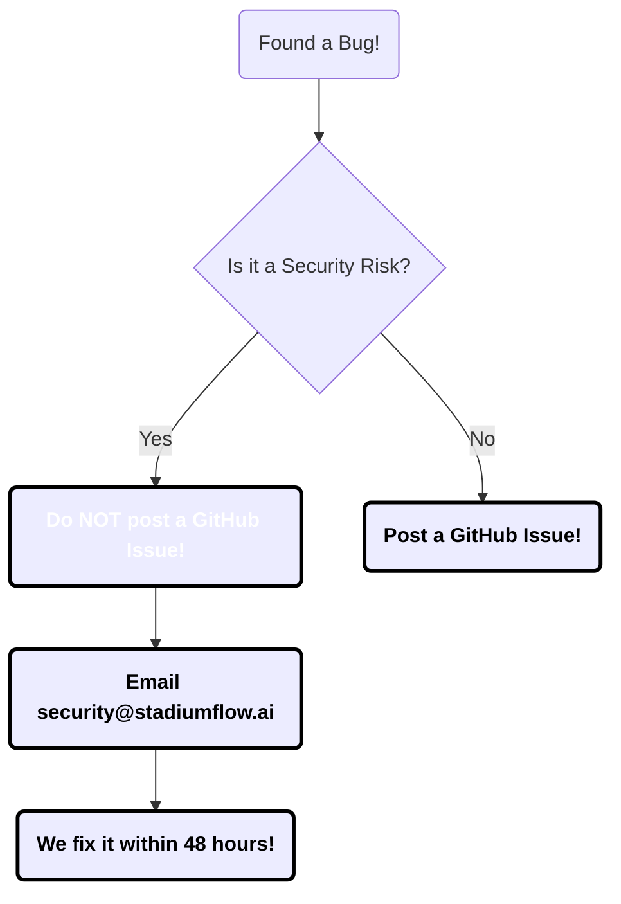

# 🛡️ Security Policy

We take the security of **StadiumFlow AI** very seriously. Even though this is an open-source project designed for a Neo-Brutalist dashboard experience, we treat fan data and staff operations with the utmost care!

---

## 🟢 Supported Versions

We currently support the latest major versions of StadiumFlow AI for security updates. 

| Version | Supported | Status |
| :--- | :--- | :--- |
| **v1.x (Current)** | ✅ Yes | Actively maintained, receives all patches! |
| **Pre-v1 (Beta)** | ❌ No | Deprecated, please update to v1.x. |

> [!IMPORTANT]
> Always ensure you are pulling the latest branch (`main`) to receive critical security patches related to Firebase and Next.js APIs.

---

## 🚨 Reporting a Vulnerability

If you are a beginner or a pro developer and you spot a security bug (like a way to bypass "God Mode" or see other fans' SOS locations), **please do not create a public GitHub issue!**

Instead, follow this safe process:

1. **Email Us:** Send an email directly to `security@stadiumflow.ai`.
2. **Include Details:** Briefly describe how you found the bug. Even if you're a beginner, just tell us what you clicked!
3. **Response Time:** We will reply within **48 hours** to confirm we received it.
4. **The Fix:** We will work on a patch and release it silently before announcing the fix to the public.

---

## 🔒 Security Best Practices for Contributors

If you are contributing code, please follow these beginner-friendly security rules:

* **Never commit API Keys!** If you are adding a `.env.local` file for Firebase or Gemini AI, make sure it is added to your `.gitignore` file. We don't want the world seeing your private passwords!
* **Update Dependencies:** We use `npm audit` to check if any of our libraries have vulnerabilities. Try to keep `package.json` up to date.
* **Sanitize Inputs:** If you add a form where a Fan can type text, always sanitize it so hackers can't inject malicious code (XSS).

> [!NOTE]
> If you aren't sure if your code is secure, open a Draft Pull Request and ask! We are a friendly community and love helping beginners learn secure coding practices. 

  
Stay Safe & Keep Coding! ⚡

